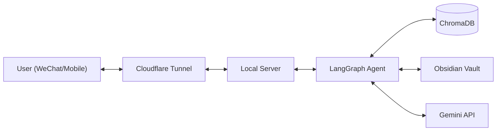

# 🧠 Personal Memory Agent (Local-First)

> A private, self-evolving AI assistant for Algorithm Engineers.
> Powered by **LangGraph**, **Gemini**, and **Obsidian**.

## 📖 Introduction

This is a personal agent designed to run on a local machine (Mac/Windows). It acts as a "Second Brain" extension, helping with memory recall, schedule management, and technical summarization.

**Core Philosophy:**
*   **Privacy First**: All vector data (ChromaDB) and notes (Obsidian) live on your local disk.
*   **Self-Improving**: The agent maintains a `user_profile.json` that evolves based on your feedback.
*   **Multimodal**: Supports image understanding via Gemini Vision.
*   **Proactive**: Pushes insights via Enterprise WeChat (WeCom).

## 🏗 Architecture

## ✨ Features
Bi-directional Sync: Chat via WeChat on mobile; data is stored locally.
Weekly Reports: RAG-based summarization of your weekly logs and commits.
Obsidian Integration: Reads your local markdown notes as knowledge base.
Smart Scheduling: Generates .ics calendar events automatically.

## 🚀 Quick Start
### 1. Installation
git clone https://github.com/yourusername/personal-agent.git
cd personal-agent
pip install -r requirements.txt
### 2. Configuration
cp config/settings.yaml.example config/settings.yaml
# Edit settings.yaml with your Gemini API Key & WeCom Config
### 3. Run
python main.py
